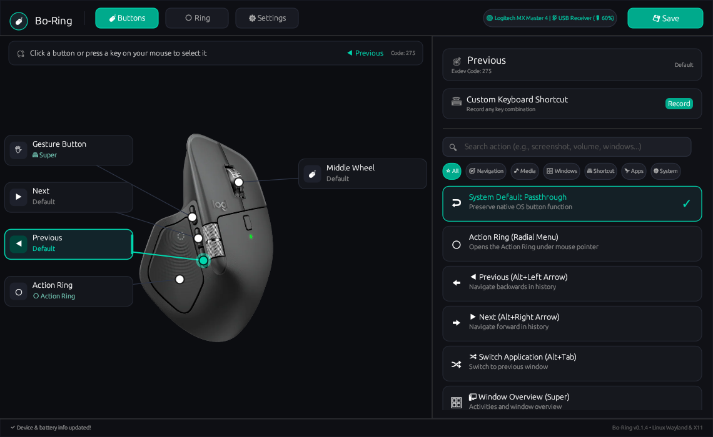
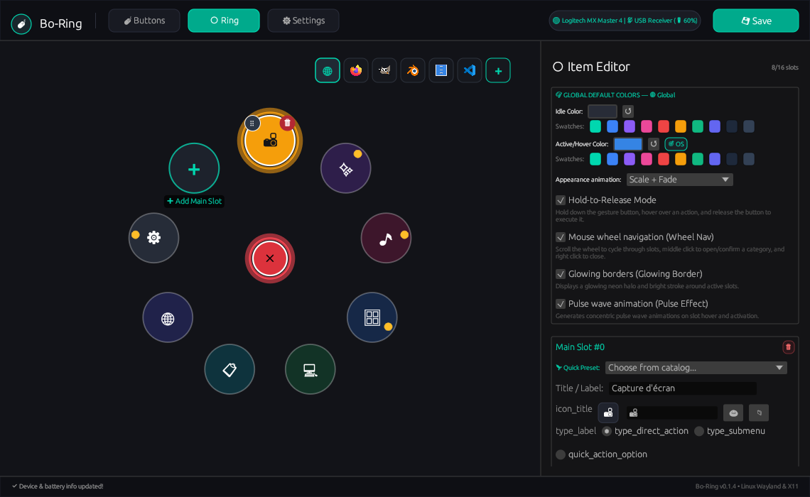

<p align="center">
  🇬🇧 <a href="../README.md">English</a> | 🇫🇷 <strong>Français</strong>
</p>

# Bo-Ring

Un menu radial en superposition (overlay) et réassignation de boutons de souris pour Linux (Wayland & X11).

<p align="center">
  <a href="https://www.rust-lang.org/"></a>
  <a href="../Cargo.toml"></a>
  <a href="https://kernel.org"></a>
  <a href="https://github.com/emilk/egui"></a>
  <a href="#internationalisation"></a>
  <a href="../LICENSE"></a>
</p>

<p align="center">
  
  
</p>

---

## Vue d'ensemble

**Bo-Ring** est un utilitaire Linux fournissant des menus radiaux de raccourcis personnalisables (**Action Rings**) et la réassignation des boutons physiques pour souris.

Une pression sur le bouton de souris assigné affiche un overlay radial centré sur le curseur. Le menu identifie automatiquement la fenêtre active pour présenter des raccourcis contextuels (navigateurs web, éditeurs de code, logiciels 3D ou gestionnaires de fichiers).

Bo-Ring inclut des profils intégrés pour les souris Logitech les plus populaires (**MX Master 4**, **MX Master 3 / 3S**, **MX Master 2S**, **MX Anywhere 3 / 3S**, **MX Vertical / Lift**, **M720 Triathlon**, **MX Ergo**, et **souris générique 5 boutons**). Un éditeur visuel intégré permet également de calibrer et de configurer n'importe quel autre modèle de souris pris en charge par le noyau Linux (`evdev`).

L'outil fonctionne dans l'espace utilisateur à partir des sous-systèmes d'entrée du noyau Linux (`evdev` et `uinput`) et est développé en Rust avec `egui`.

---

## Fonctionnalités

- **Menus radiaux contextuels** : Nombre d'emplacements configurable (jusqu'à 16 par défaut) avec prise en charge de sous-menus imbriqués, icônes ou émojis personnalisés et synchronisation avec la couleur d'accentuation du bureau.
- **Profils par application** : Affiche automatiquement des menus adaptés selon la fenêtre active (Firefox, VS Code, GIMP, Blender, etc.).
- **Réassignation des boutons de souris** : Associe les boutons reconnus via `evdev` (boutons latéraux, repose-pouce, boutons DPI) à des menus radiaux, combinaisons de touches, commandes shell ou actions multimédia.
- **Éditeur visuel de modèle** : Positionnement visuel des ancres de boutons sur une illustration de souris, détection des codes d'événements par simple clic et ajout de boutons personnalisés directement dans l'interface.
- **Profils de périphériques personnalisés** : Définition des souris stockée sous forme de fichiers JSON (`~/.config/bo-ring/devices/` ou `/usr/share/bo-ring/devices/`) avec prise en charge d'illustrations personnalisées.
- **Identification matérielle** : Reconnaissance du périphérique connecté par ses identifiants USB ou Bluetooth (VID:PID).
- **Modes de déclenchement** :
  - **`Hybrid` (Par défaut)** : Un clic rapide maintient le menu ouvert ; un appui prolongé déclenche l'action ciblée au relâchement.
  - **`Click`** : Un clic ouvre le menu, un clic sur un emplacement déclenche l'action, le bouton central ferme le menu.
  - **`HoldToRelease`** : Maintenir le bouton enfoncé, survoler l'action souhaitée et relâcher pour exécuter.
- **Navigation à la molette** : Défilement circulaire dans les emplacements, clic molette pour valider et clic droit pour revenir en arrière dans les sous-menus.
- **Rechargement à chaud de la configuration** : Les modifications enregistrées dans l'interface s'appliquent immédiatement au service en arrière-plan sans redémarrage.
- **Prise en charge des dispositions de clavier** : Gestion des dispositions AZERTY et QWERTY pour la simulation de frappes clavier.
- **État et niveau de batterie** : Affichage du niveau de batterie et de l'état de connexion pour les appareils Logitech (HID++) et Bluetooth Low Energy compatibles.
- **Fonctionnement sans privilèges root** : Exécution intégrale dans l'espace utilisateur via des règles `udev` de session standard (`uaccess`).
- **Multilingue** : Interface disponible en français, anglais et espagnol avec détection automatique de la langue du système.

---

## Compatibilité

### Environnements de bureau

Bo-Ring détecte la fenêtre active sur les compositeurs Wayland et X11 :

| Environnement | Mécanisme | Notes |
| :--- | :--- | :--- |
| **GNOME Shell (Wayland & X11)** | Extension D-Bus | Suivi de la fenêtre sous le curseur via `bo-ring-window-tracker@flavien` |
| **KDE Plasma 5 / 6 (Wayland & X11)** | `kdotool` / `xprop` | CLI `kdotool` avec fallback `xprop` |
| **Hyprland** | IPC Wayland native | `hyprctl activewindow` |
| **Sway / wlroots** | IPC Wayland native | `swaymsg -t get_tree` |
| **X11 (Générique)** | EWMH (`_NET_ACTIVE_WINDOW`) | XFCE, MATE, i3, bspwm, etc. |

### Matériel pris en charge

Bo-Ring fonctionne avec toute souris prise en charge par le noyau Linux via `evdev` :

- **Prise en charge matérielle** : Toute souris USB ou Bluetooth exposant des événements d'entrée peut être reconnue et remappée.
- **Profils intégrés** :
  - **Logitech MX Master 4** : Bouton haptique pouce (`278`), bouton gestes (`281` / CID `0x00C3`), bouton SmartShift (`280` / CID `0x00C4`), boutons latéraux (`276`/`275`), clic molette (`274`).
  - **Logitech MX Master 3 & 3S** : Bouton repose-pouce (`278` / CID `0x00C3`), SmartShift (`280` / CID `0x00C4`), boutons latéraux (`276`/`275`), clic molette (`274`).
  - **Logitech MX Master 2S** : Bouton repose-pouce (`278` / CID `0x00C3`), SmartShift (`280` / CID `0x00C4`), boutons latéraux derrière la molette de pouce (`276`/`275`), clic molette (`274`).
  - **Logitech MX Anywhere 3 & 3S** : Bouton supérieur de mode molette (`280` / CID `0x00C4`), boutons latéraux (`276`/`275`), clic molette (`274`).
  - **Logitech MX Vertical & Lift** : Bouton supérieur DPI (`280` / CID `0x00FD`), boutons latéraux (`276`/`275`), clic molette (`274`).
  - **Logitech M720 Triathlon** : Bouton gestes caché sous le pouce (`278` / CID `0x00D0`), boutons latéraux (`276`/`275`), clic molette (`274`).
  - **Logitech MX Ergo Trackball** : Bouton de précision (`277` / CID `0x00ED`), boutons latéraux (`276`/`275`), clic molette (`274`).
  - **Souris générique 5 boutons** : Bouton suivant (`276`), précédent (`275`), clic molette (`274`).
- **Modèles personnalisés** : D'autres souris (modèles de jeu, trackballs, souris verticales ergonomiques) peuvent être configurées et calibrées via l'éditeur visuel intégré.

| Bouton physique | Code événement | Assignation par défaut | Réassignation personnalisée |
| :--- | :---: | :--- | :--- |
| **Repose-pouce (Bouton geste)** | `278` | Overlay Action Ring | Oui |
| **Bouton grip pouce** | `277` | Terminal (`gnome-terminal`) | Oui |
| **Bouton latéral avant (Suivant)** | `276` | Suivant navigateur | Oui |
| **Bouton latéral arrière (Précédent)** | `275` | Précédent navigateur | Oui |
| **Clic molette** | `274` | Clic central | Oui |
| **Clic gauche & droit** | `272` / `273` | Clic principal / secondaire | Protégés (non réassignables pour sécurité) |

---

## Installation

### Installation automatisée (Recommandée)

Le script d'installation prend en charge à la fois la compilation depuis les sources et l'utilisation de binaires précompilés, configure les permissions `udev` sans root, et démarre le service :

```bash
git clone https://github.com/BazinFla/bo-ring.git
cd bo-ring
./install.sh
```

Le script effectue automatiquement :
1. La compilation du binaire release via `cargo` (ou l'installation du binaire précompilé).
2. L'installation des règles udev (`/etc/udev/rules.d/99-bo-ring-uinput.rules`) autorisant l'accès utilisateur non privilégié à `/dev/uinput` et aux périphériques d'entrée.
3. L'activation et le démarrage du service utilisateur `systemd` (`bo-ring.service`).
4. L'installation des raccourcis du bureau dans le lanceur d'applications.
5. Le déploiement de l'extension de détection GNOME Shell (sous GNOME) ou la vérification de `kdotool` (sous KDE Plasma).

### Paquets précompilés (.deb / .rpm / tar.gz)

Des paquets prêts à installer pour Debian/Ubuntu, Fedora/RHEL, ainsi qu'une archive autonome `.tar.gz` sont disponibles sur la page des [Releases GitHub](https://github.com/BazinFla/bo-ring/releases).

- **Debian / Ubuntu** :
  ```bash
  sudo dpkg -i bo-ring_0.2.0_amd64.deb
  systemctl --user enable --now bo-ring.service
  ```
- **Fedora / RHEL** :
  ```bash
  sudo rpm -i bo-ring-0.2.0-1.x86_64.rpm
  systemctl --user enable --now bo-ring.service
  ```

### Compilation manuelle

```bash
git clone https://github.com/BazinFla/bo-ring.git
cd bo-ring
cargo build --release
./target/release/bo-ring
```

### Remarque pour GNOME Shell (Wayland)

Sous GNOME avec Wayland, le rechargement à chaud des extensions n'est pas pris en charge par le compositeur. Après l'installation :
1. **Redémarrez votre session** (déconnexion puis reconnexion) pour que GNOME Shell prenne en compte l'extension.
2. **Vérifiez que l'extension est active** :
   ```bash
   gnome-extensions list --enabled | grep bo-ring
   ```
   Si nécessaire, activez-la avec :
   ```bash
   gnome-extensions enable bo-ring-window-tracker@flavien
   ```
*(Sous GNOME X11, appuyer sur `Alt`+`F2`, taper `r` puis valider par Entrée suffit pour recharger le compositeur).*

---

## Utilisation

### Interface de configuration

Ouvrez le panneau de contrôle depuis le lanceur d'applications ou exécutez :

```bash
bo-ring
```

Depuis l'interface, vous pouvez :
- Réassigner les boutons physiques et choisir le mode de déclenchement.
- Calibrer visuellement la position des boutons et en ajouter pour votre modèle de souris.
- Créer et personnaliser les Action Rings par application.
- Personnaliser les thèmes, couleurs d'accentuation et animations.

### Référence CLI

| Commande | Description |
| :--- | :--- |
| `bo-ring` | Lance l'interface graphique de configuration |
| `bo-ring --daemon` | Exécute le daemon d'écoute d'événements et de réassignation en arrière-plan |
| `bo-ring --ring` | Ouvre directement le menu radial (utile pour tester ou affecter à un raccourci personnalisé) |
| `bo-ring --uninstall` | Lance l'outil de désinstallation |

### Gestion du service en arrière-plan

Le daemon est géré comme un service utilisateur standard via `systemd` :

```bash
# Vérifier l'état du service
systemctl --user status bo-ring.service

# Consulter les journaux en direct
journalctl --user -u bo-ring.service -f

# Redémarrer le daemon
systemctl --user restart bo-ring.service
```

---

## Configuration

Les réglages et profils personnalisés sont stockés dans `~/.config/bo-ring/` :

```
~/.config/bo-ring/
├── config.toml           # Paramètres principaux (assignations matérielles, mode de déclenchement, apparence)
├── rings/                # Définitions des menus radiaux par application (*.ring.toml)
├── actions/              # Actions personnalisées réutilisables (*.action.toml)
└── devices/              # Profils de souris personnalisés (*.json) et illustrations
```

### Exemple de `config.toml`

```toml
[general]
device_name = "Logitech MX Master 4"
theme = "dark"
language = "system" # "system", "en", "fr", "es"
autostart_daemon = true

[buttons]
278 = { type = "ShowRingMenu" }                           # Bouton geste pouce -> Action Ring
277 = { type = "Command", cmd = "gnome-terminal" }        # Bouton grip pouce -> Terminal
276 = { type = "KeyCombo", keys = ["CTRL", "ALT", "T"] } # Bouton latéral avant -> Raccourci personnalisé

[ring_menu]
default_color = "#282C37"
default_active_color = "#00D7AF"
animation = "ScaleFade" # "ScaleFade" ou "None"
trigger_mode = "Hybrid" # "Hybrid", "Click" ou "HoldToRelease"
wheel_navigation = true
max_slots = 16
glow_effect = true
pulse_effect = true
```

---

## Internationalisation

Traductions disponibles :

- 🇬🇧 **English** (`en`)
- 🇫🇷 **Français** (`fr`)
- 🇪🇸 **Español** (`es`)

La langue est détectée automatiquement selon la variable d'environnement du système (`LANG`) et peut être sélectionnée manuellement dans les paramètres.

---

## Désinstallation

Pour supprimer Bo-Ring, le service systemd, les règles udev et les fichiers de configuration :

```bash
bo-ring --uninstall
# ou depuis le répertoire du dépôt :
./uninstall.sh
```

---

## À propos du projet & Retours

Bo-Ring est un projet personnel que je maintiens initialement pour mon propre usage quotidien. Les tests sont réalisés avec le matériel à ma disposition (notamment les souris de la série Logitech MX Master) et principalement sous **Fedora GNOME (dernière version)**, ainsi qu'occasionnellement sous **Debian**.

Bien que l'application soit conçue pour fonctionner avec d'autres distributions Linux, environnements de bureau et modèles de souris, des ajustements peuvent être nécessaires selon les configurations. Si vous testez l'outil, vos retours, signalements de bugs ou partages de profils pour d'autres modèles de souris sont les bienvenus via les issues ou pull requests GitHub.

---

## Licence

Bo-Ring est distribué sous licence open source [MIT](../LICENSE).

---

## Marques déposées et logos tiers

Tous les noms de produits et d'entreprises mentionnés (*Logitech*, *Firefox*, *Blender*, *GIMP*, *Visual Studio Code*) sont des marques déposées appartenant à leurs propriétaires respectifs. Leur mention ici est faite à titre purement informatif et de compatibilité, et n'implique aucune affiliation ou approbation de leur part.
